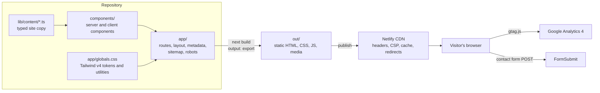

# Rohit Singh portfolio

The personal portfolio of Rohit Singh, senior software engineer and founder of Sushraj Ventures. It is a statically exported Next.js site, served by Netlify at [dcrohit-portfolio.netlify.app](https://dcrohit-portfolio.netlify.app).

[](CHANGELOG.md)
[](https://github.com/DivisionCode/rohit-singh-portfolio/actions/workflows/ci.yml)
[](.nvmrc)
[](https://nextjs.org)
[](https://www.typescriptlang.org)
[](https://tailwindcss.com)
[](LICENSE)
[](https://dcrohit-portfolio.netlify.app)

## Contents

- [Overview](#overview)
- [Features](#features)
- [Tech stack](#tech-stack)
- [Architecture](#architecture)
- [Getting started](#getting-started)
- [Environment variables](#environment-variables)
- [Scripts](#scripts)
- [Project structure](#project-structure)
- [Editing content](#editing-content)
- [Quality checks](#quality-checks)
- [Deployment](#deployment)
- [Versioning and releases](#versioning-and-releases)
- [Contributing](#contributing)
- [Security](#security)
- [Licence](#licence)
- [Ownership](#ownership)

## Overview

The site is a single home page plus a case study page for each piece of work. It presents:

- Sushraj Ventures, Rohit Singh's group, and the businesses inside it: Sushraj Pharma, Arthmala and DCodeIntellect.
- Engagements outside the group, listed separately from the group's own businesses.
- The DCodeIntellect product line, with a case study for each product.
- A reference architecture, engineering principles, the production technology stack, certifications and a contact form.

All copy is typed data in `lib/content/`. `next build` compiles the site to plain files in `out/`, and Netlify serves them without a Node.js runtime.

Version 2.0.0 replaced the earlier hand-written HTML and CSS site, which remains in git history up to the `v1.0.0` tag. See [CHANGELOG.md](CHANGELOG.md).

## Features

- **Static export.** `output: "export"` with `trailingSlash: true`, so every route is prerendered HTML.
- **Generated case studies.** `app/work/[slug]/page.tsx` uses `generateStaticParams` to build one page at `/work/<slug>/` for every venture and product in `lib/content/work.ts`. Where a venture has a live site, its screenshot sits behind the masthead, masked diagonally so the heading stays readable.
- **Home page sections**, in page order: hero, stack ticker, Ventures, Architecture, Products, Approach, Stack, Experience, Credentials and Contact. Experience renders nothing until it has complete records.
- **Command palette.** Cmd+K, Ctrl+K or the header button opens it. It searches sections, case studies and social profiles, and can copy the email address or download the CV.
- **Light and dark themes.** An inline script applies the stored choice, or the system preference, before first paint so there is no flash. The choice is kept in `localStorage`.
- **Scroll-driven reveals** use native CSS `animation-timeline: view()`. They apply only when the browser supports it and the visitor has not asked for reduced motion; otherwise the content is simply visible.
- **Interface details:** a scroll-position nav highlight, a scroll progress bar, metric counters that render their final value on the server, and a pointer spotlight on cards.
- **Graphics in SVG and CSS.** The hero lattice, the monogram and the case study flow rails are server-rendered SVG and CSS, with no canvas, WebGL or client JavaScript. The SVG draws in `currentColor`, so it follows the theme.
- **Contact form** posting to [FormSubmit](https://formsubmit.co), with loading, success and error states, a fallback that works without JavaScript, and a honeypot field.
- **SEO:** per-route metadata through the Next.js Metadata API, Open Graph and Twitter cards, `schema.org/Person` JSON-LD, generated `sitemap.xml` and `robots.txt`, a Google Search Console verification file and a Pinterest domain verification tag.
- **Analytics:** Google Analytics 4, loaded after hydration.
- **Hosting configuration:** security headers and a Content Security Policy, long-lived cache headers for hashed assets, and 301 redirects for legacy and retired URLs, all in `netlify.toml`.
- **Accessibility:** a skip link, labelled navigation landmarks, `aria-current` on the active nav item, and decorative graphics hidden from assistive technology.

## Tech stack

Versions are the ones resolved in `package-lock.json`. The ranges declared in `package.json` are shown where they differ.

| Layer | Technology | Version | Purpose |
| --- | --- | --- | --- |
| Framework | Next.js (App Router, Turbopack builds) | 16.3.5 | Routing, metadata, static generation and the `output: "export"` build |
| UI library | React and React DOM | 19.2.8 | Server components, plus seven client components that hydrate in the browser |
| Language | TypeScript | 5.9.3 (`^5`) | `strict` type checking, run by `npm run typecheck` |
| Styling | Tailwind CSS | 4.3.3 (`^4`) | CSS-first configuration: `@theme` tokens and `@utility` definitions in `app/globals.css`, no JS config |
| CSS pipeline | `@tailwindcss/postcss` on PostCSS | 4.3.3 / 8.5.28 | Compiles Tailwind through `postcss.config.mjs` |
| Fonts | `next/font/google`: Schibsted Grotesk | Bundled with Next.js 16.3.5 | One typeface, weights 400 to 700, self-hosted at build time with `display: swap` |
| Images | `next/image`, unoptimised | Bundled with Next.js 16.3.5 | Explicit sizes, because image optimisation needs a server and this is a static export |
| SEO | Metadata API, `sitemap.ts`, `robots.ts`, schema.org JSON-LD | Bundled with Next.js 16.3.5 | Titles, canonical URLs, social cards, sitemap, robots rules and structured data |
| Linting | ESLint with `eslint-config-next` (core web vitals and TypeScript presets) | 9.39.5 (`^9`) / 16.3.5 | Flat config in `eslint.config.mjs` |
| Type definitions | `@types/node`, `@types/react`, `@types/react-dom` | 20.19.43 / 19.3.0 / 19.3.0 | Types for Node.js and React |
| Browser automation | Playwright (Chromium) | 1.63.0 (`^1.63.0`) | Drives the browser checks and screenshot tools in `scripts/` |
| Project tooling | Node.js ES modules in `scripts/*.mjs` | Not versioned | Visual, behavioural, performance, analytics and house style checks (see [Scripts](#scripts)) |
| Runtime | Node.js | 22 | Pinned in `.nvmrc`, `engines.node` (`>=22`) and Netlify's `NODE_VERSION` |
| Package manager | npm | Lockfile version 3 | `npm ci` installs exactly what `package-lock.json` records |
| Analytics | Google Analytics 4 (gtag.js) | Hosted service | Loaded with `next/script` after hydration, with `anonymize_ip` set |
| Contact form | FormSubmit | Hosted service | Delivers contact form submissions by email; no backend of our own |
| Hosting | Netlify | Hosted service | Runs `npm run build` and publishes `out/` |
| Security headers | HTTP headers and CSP in `netlify.toml` | Not versioned | HSTS, `X-Frame-Options`, `X-Content-Type-Options`, `Referrer-Policy`, `Permissions-Policy` and a Content Security Policy |
| Continuous integration | GitHub Actions: `actions/checkout`, `actions/setup-node` | v7 / v7 | Lint, typecheck, house style and build on every push to `master` and every pull request |

The seven client components are `Header`, `ScrollProgress`, `ThemeToggle`, `CommandPalette`, `Counter`, `Spotlight` and `ContactForm`. Everything else renders at build time. There is no animation library, no state management library and no CSS-in-JS.

## Architecture



1. **Content.** Every string on the site comes from `lib/content/`. Components import it; they hold no copy of their own.
2. **Components.** `components/home/` has one component per home page section. `components/site/` holds the chrome, `components/ui/` the shared primitives, `components/visual/` the SVG graphics and `components/work/` the case study pieces.
3. **Routes.** `app/layout.tsx` sets fonts, metadata, JSON-LD, the theme script and analytics. `app/page.tsx` composes the home page, and `app/work/[slug]/page.tsx` renders each case study.
4. **Build.** `next build` prerenders every route into `out/`. The generated `sitemap.xml` and `robots.txt` are forced static.
5. **Delivery.** Netlify builds `master`, publishes `out/`, and applies the headers, cache rules and redirects in `netlify.toml`.
6. **Third parties at runtime.** The browser loads gtag.js from Google and sends measurement hits to Google Analytics. The contact form posts to FormSubmit. The CSP allows exactly these hosts.

## Getting started

### Prerequisites

- Node.js 22 (`.nvmrc`). `engines.node` requires 22 or later.
- npm, which ships with Node.js.
- For the browser checks only: Playwright's Chromium, installed once with `npx playwright install chromium`.

### Install and run

```bash
git clone https://github.com/DivisionCode/rohit-singh-portfolio.git
cd rohit-singh-portfolio
nvm use          # picks up Node 22 from .nvmrc
npm ci
npm run dev      # http://localhost:3000
```

`next dev` maintains a managed block of agent instructions in `AGENTS.md`, which `CLAUDE.md` references. The block is committed, so a dev session leaves the tree clean.

### Build and preview

```bash
npm run build          # static export into out/
npx serve@latest out   # serve the export locally
```

`npm run start` runs `next start`, which Next.js does not support with `output: "export"`. Serve `out/` with any static file server instead, as above.

### Type checking on a fresh clone

`LayoutProps` and `PageProps` are global type helpers that Next.js generates into `.next/types/`, along with `next-env.d.ts`. Neither is committed. Generate them once before the first `npm run typecheck`:

```bash
npx next typegen
npm run typecheck
```

`npm run dev` and `npm run build` also generate them.

## Environment variables

None. The site reads no environment variables at build time or at runtime.

The values that could have been configuration are constants in `lib/content/site.ts`: the site URL, the Google Analytics measurement ID and the FormSubmit endpoint. None of them is secret. The only build setting is `NODE_VERSION = "22"`, which `netlify.toml` gives to Netlify's build image. `.env*` files are ignored by git.

## Scripts

| Script | Runs | What it does |
| --- | --- | --- |
| `dev` | `next dev` | Development server at `http://localhost:3000`, with hot reload. |
| `build` | `next build` | Static export into `out/`. This is exactly what Netlify publishes. |
| `start` | `next start` | Not usable with this project: Next.js refuses `next start` under `output: "export"`. Serve `out/` with a static server instead. |
| `lint` | `eslint` | ESLint with the Next.js core web vitals and TypeScript presets. |
| `typecheck` | `tsc --noEmit` | Strict TypeScript check. Needs the generated route types (see [Getting started](#type-checking-on-a-fresh-clone)). |
| `dashes` | `scripts/dashes.mjs` | House style guard. Fails on any dash-like character other than the ASCII hyphen-minus (hyphen, non-breaking hyphen, figure dash, en dash, em dash, horizontal bar, minus sign, soft hyphen) in `.ts`, `.tsx`, `.css`, `.md`, `.json`, `.toml` and `.html` files. Also fails on a `h-px` element 2 to 6 units wide, which renders as an em dash. Skips `node_modules`, `.next`, `out`, `screens`, dot-prefixed entries, `AGENTS.md` and `CLAUDE.md`. Needs no server. |
| `shoot` | `scripts/shoot.mjs` | Screenshots the home page (full desktop, desktop fold, full mobile) and two case study pages into `screens/`, after scrolling to settle every reveal, and prints each page height. |
| `verify` | `scripts/verify.mjs` | Scrolls the home page and two case study pages in 600px steps. Fails if any element that has settled on screen is below full opacity or still blurred, which catches content stuck behind an unfinished animation. |
| `smoke` | `scripts/clicks.mjs` | Hit-tests the nav links, both calls to action and the command menu button, clicks a nav link to confirm the page scrolls, opens the command palette and lists any page errors. Reports only; it does not fail the run. |
| `navspy` | `scripts/navspy.mjs` | Scrolls to each nav section and fails if the nav highlights a different one. |
| `navclick` | `scripts/navclick.mjs` | Clicks each nav link with smooth scrolling on and fails if the highlight does not land on the clicked section. |
| `form` | `scripts/form.mjs` | Drives the real contact form with FormSubmit intercepted, so nothing is sent. Checks that validation blocks an empty submit, that the request is a JSON POST with the expected fields and an empty honeypot, that success clears the form, that a rejection shows an alert, and that the no-JavaScript fallback posts to the non-AJAX endpoint. |
| `gaps` | `scripts/gaps.mjs` | Prints the vertical distance between where one section's content ends and the next one's begins, plus the total page height. Reports only. |
| `perf` | `scripts/perf.mjs` | Reports load time, long tasks during load, scroll frame times (median, p90, p99, worst, frames over 50 ms), the cost of pointer moves over the spotlight cards, and DOM weight. Reports only. |
| `capture` | `scripts/capture.mjs` | Screenshots the live site of each venture listed in the script into `public/media/site/` at 1440 by 900, 2x, as JPEG. Needs internet access. |
| `ga` | `scripts/ga.mjs` | Loads the live site, or a URL passed as the first argument, and fails if the CSP blocks any Google Analytics measurement request or none is delivered. Blocked advertising requests are counted and are intentional. |

`shoot`, `verify`, `smoke`, `navspy`, `navclick`, `form`, `gaps` and `perf` need a running copy of the site. They default to port 3000 on `localhost` or `127.0.0.1` and accept another base URL as their first argument, for example `npm run verify -- http://localhost:5000`.

`scripts/` also holds three helpers with no npm script, run with `node` against `localhost:3000`. `sections.mjs` screenshots each home page section. `one.mjs <id> [dark|light]` screenshots one section in one theme. `themes.mjs` screenshots the home page in both themes.

## Project structure

```text
.
  .github/                 CI workflow, CODEOWNERS, issue and pull request templates
  app/
    layout.tsx             Fonts, metadata, JSON-LD, theme script, analytics, header and footer
    page.tsx               Home page: composes the section components
    globals.css            Design tokens (@theme), custom utilities (@utility), reveals
    work/[slug]/page.tsx   Case study page, generated for every work item
    not-found.tsx          404 page
    sitemap.ts robots.ts   Generated sitemap.xml and robots.txt
    icon.svg               Favicon
  components/
    home/                  One component per home page section, plus the contact form and ticker
    site/                  Header, footer, command palette, theme toggle, scroll progress
    ui/                    Icon, Reveal, SectionHeading, Tag, Counter, Spotlight
    visual/                Hero lattice, monogram, case study screenshot backdrop
    work/                  Case study flow rail
  lib/
    content/               All site copy, as typed data (see Editing content)
    cn.ts                  Class name joiner
  public/
    docs/                  CV and certificate PDFs
    logos/                 Company and technology logos
    media/                 Headshot, grain texture, venture site screenshots, product images
    google11e1704e48f5c4c0.html   Google Search Console verification
  scripts/                 Playwright checks, screenshot tools and the house style guard
  netlify.toml             Build settings, headers, CSP, cache rules, redirects
  next.config.ts           Static export, trailing slashes, unoptimised images, dev origins
  eslint.config.mjs        ESLint flat config
  postcss.config.mjs       Tailwind CSS v4 through PostCSS
  tsconfig.json            Strict TypeScript, `@/*` path alias
```

`out/`, `.next/`, `screens/`, `node_modules/`, `next-env.d.ts` and `*.tsbuildinfo` are generated and ignored by git.

## Editing content

All copy is data. To change what the site says, edit a file in `lib/content/`; no JSX is needed.

| File | Holds |
| --- | --- |
| `lib/content/site.ts` | Site URL, analytics ID, contact form endpoint, profile (name, group, bio, location, contact details, CV path), social links, nav links, career start year and headline metrics |
| `lib/content/work.ts` | Ventures (inside and outside the group) and products, including every case study's narrative, highlights, facts and links |
| `lib/content/architecture.ts` | The layers of the reference architecture and where each is in production |
| `lib/content/approach.ts` | The engineering principles, each with a line of evidence |
| `lib/content/stack.ts` | The technology groups shown in the Stack section and the ticker |
| `lib/content/credentials.ts` | Certifications, newest first, with verification links |
| `lib/content/experience.ts` | Employment history (see below) |

### Adding a venture or product

Add an entry to `ventures` or `products` in `lib/content/work.ts`. A venture's `group` is `"owned"` for a business inside Sushraj Ventures and `"led"` for an engagement outside it. The build then:

- generates its `/work/<slug>/` page,
- adds it to `sitemap.xml`,
- adds it to the command palette and the 404 page's links, and
- for a venture with a link of kind `"site"`, adds it to `worksFor` in the JSON-LD.

For a venture with a live site, add its URL to `SITES` in `scripts/capture.mjs`, run `npm run capture`, commit the new image in `public/media/site/`, and set `preview` on the entry. The images are committed so the build never depends on those sites being up.

### Metrics

The years figure is derived from `CAREER_START` in `site.ts`. The other headline metrics are literal numbers in the `metrics` array. Update them when the ventures, products or stack change.

### Experience

`lib/content/experience.ts` carries four companies with empty `title`, `period`, `summary` and `work` fields. An entry with an empty `title` or `period` is skipped, and the section renders nothing while every entry is skipped. Fill in a role's `title` and `period` and it appears on the home page between Stack and Credentials.

### Contact form

The form posts to FormSubmit, with no backend and no API key. A FormSubmit endpoint must be activated once: submit the form after the first deploy to a new address, and FormSubmit emails a confirmation link to the inbox in `CONTACT_FORM_ENDPOINT`. Until the link is clicked, submissions are held. `npm run form` intercepts the network, so it never consumes that activation.

To route mail to another inbox, change `CONTACT_FORM_ENDPOINT` in `lib/content/site.ts` and activate the new address.

## Quality checks

The static checks run in CI on every push to `master` and every pull request ([`.github/workflows/ci.yml`](.github/workflows/ci.yml)). Run them locally before pushing:

```bash
npm run lint
npx next typegen && npm run typecheck
npm run dashes
npm run build
```

The browser checks need Playwright's Chromium and a running copy of the site (`npm run dev`, or `out/` behind a static server). Run the ones that cover your change:

```bash
npm run verify     # nothing settled on screen is faded or blurred
npm run smoke      # nav, calls to action and command palette respond
npm run navspy     # nav highlight follows scrolling
npm run navclick   # nav highlight follows clicks
npm run form       # contact form request, success and failure paths
npm run perf       # load, scroll and pointer cost
npm run gaps       # spacing between sections
npm run shoot      # screenshots for review, in screens/
```

After a deploy that touches `netlify.toml` or analytics, run `npm run ga` against the live site. The CSP is set by Netlify, so no local run exercises it.

House style and the engineering conventions these checks enforce are in [CONTRIBUTING.md](CONTRIBUTING.md).

## Deployment

Netlify builds and deploys the `master` branch. Everything it needs is in `netlify.toml`:

- **Build:** `npm run build` on Node.js 22, publishing `out/`.
- **Headers on every path:** `Strict-Transport-Security` (one year, subdomains, preload), `X-Frame-Options: DENY`, `X-Content-Type-Options: nosniff`, `Referrer-Policy: strict-origin-when-cross-origin`, a `Permissions-Policy` that turns off camera, microphone, geolocation and interest cohorts, and the Content Security Policy.
- **Content Security Policy:** same-origin by default. Scripts may also load from Google Tag Manager and Google Analytics, connections may go to Google Analytics and FormSubmit, and forms may post to FormSubmit. Inline scripts and styles are allowed (`'unsafe-inline'`), because the exported pages carry inline scripts: the Next.js payload, the theme script and the analytics initialiser. `frame-ancestors 'none'`, `base-uri 'self'` and `object-src 'none'` are set. Google advertising endpoints are deliberately not allowed.
- **Caching:** `/_next/static/*` is immutable for a year; `/media/*` and `/logos/*` are cached for a week.
- **Redirects (301):** legacy URLs from the hand-written site (`/index.html`, `/brief.html`, `/contact.html`, `/login.html`, `/payrollDashboard.html`) and the retired product pages (`/work/d-trade/*`, `/work/d-analysis/*`) go to their current homes.

GitHub Actions CI runs separately from Netlify's build. Merge to `master` only when CI passes.

## Versioning and releases

The project follows [Semantic Versioning](https://semver.org/spec/v2.0.0.html). The version lives in `package.json`, and every release is recorded in [CHANGELOG.md](CHANGELOG.md) in the [Keep a Changelog](https://keepachangelog.com/en/1.1.0/) format.

- **Major:** a restructure or redesign of the site, or a change that breaks existing URLs.
- **Minor:** new sections, pages, content types or tooling.
- **Patch:** fixes, copy corrections and dependency updates.

Each release is tagged `vX.Y.Z` on `master` and published as a GitHub Release. The steps are in [CONTRIBUTING.md](CONTRIBUTING.md#releases).

## Contributing

See [CONTRIBUTING.md](CONTRIBUTING.md) for branch naming, Conventional Commits, pull requests, house style, checks and the release process. Bug reports and feature requests use the templates in `.github/ISSUE_TEMPLATE/`.

## Security

Do not report vulnerabilities in a public issue. See [SECURITY.md](SECURITY.md) for how to report one privately, and for what is in scope.

## Licence

Proprietary. Copyright (c) 2025-2026 Rohit Singh. All rights reserved. The source is published for reference only; no licence is granted to use, copy, modify or distribute the code or content without prior written permission. See [LICENSE](LICENSE).

## Ownership

| | |
| --- | --- |
| Owner and maintainer | Rohit Singh |
| GitHub | [@DivisionCode](https://github.com/DivisionCode) (code owner for every path, see [`.github/CODEOWNERS`](.github/CODEOWNERS)) |
| Contact | singh.rsingh.rohit@gmail.com |
| Repository | [DivisionCode/rohit-singh-portfolio](https://github.com/DivisionCode/rohit-singh-portfolio) |
| Live site | [dcrohit-portfolio.netlify.app](https://dcrohit-portfolio.netlify.app) |
